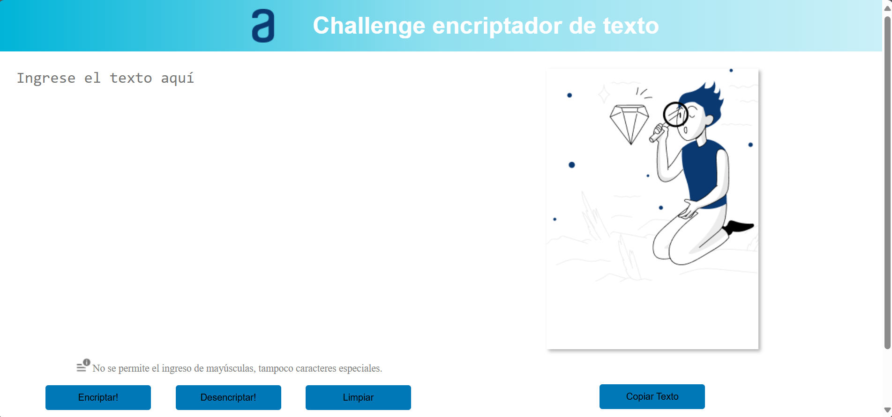

# encriptador-de-texto-html-css-js

Este proyecto es una aplicación web simple que permite encriptar y desencriptar texto siguiendo un esquema de sustitución de caracteres específicos. También incluye funcionalidades para copiar el texto resultante al portapapeles y mostrar notificaciones al usuario.

## Funcionalidades

1. **Encriptar Texto**
    - Convierte el texto de entrada reemplazando las letras específicas:
        - `a` se convierte en `ai`
        - `e` se convierte en `enter`
        - `i` se convierte en `imes`
        - `o` se convierte en `ober`
        - `u` se convierte en `ufat`
    - Las letras consonantes no se modifican.

2. **Desencriptar Texto**
    - Reemplaza las secuencias encriptadas de vuelta a las letras originales:
        - `ai` se convierte en `a`
        - `enter` se convierte en `e`
        - `imes` se convierte en `i`
        - `ober` se convierte en `o`
        - `ufat` se convierte en `u`

3. **Copiar al Portapapeles**
    - Copia el texto del campo de salida al portapapeles.
    - Si el campo de salida está vacío, se muestra una notificación indicando que no hay texto para copiar.
    - Si la copia es exitosa, se muestra una notificación indicando que el texto ha sido copiado al portapapeles.

4. **Notificaciones**
    - Las notificaciones informan al usuario sobre eventos como campos vacíos, éxito o fallo al copiar texto.
    - Las notificaciones se muestran temporalmente durante unos segundos.

5. **Validación de Entrada**
    - Solo se permiten letras minúsculas sin acentos en el campo de entrada.
    - Cualquier otro carácter ingresado se elimina automáticamente.

6. **Imagen de Fondo**
    - El `textarea` de salida tiene una imagen de fondo por defecto.
    - La imagen de fondo se oculta cuando el `textarea` contiene texto encriptado o desencriptado.

